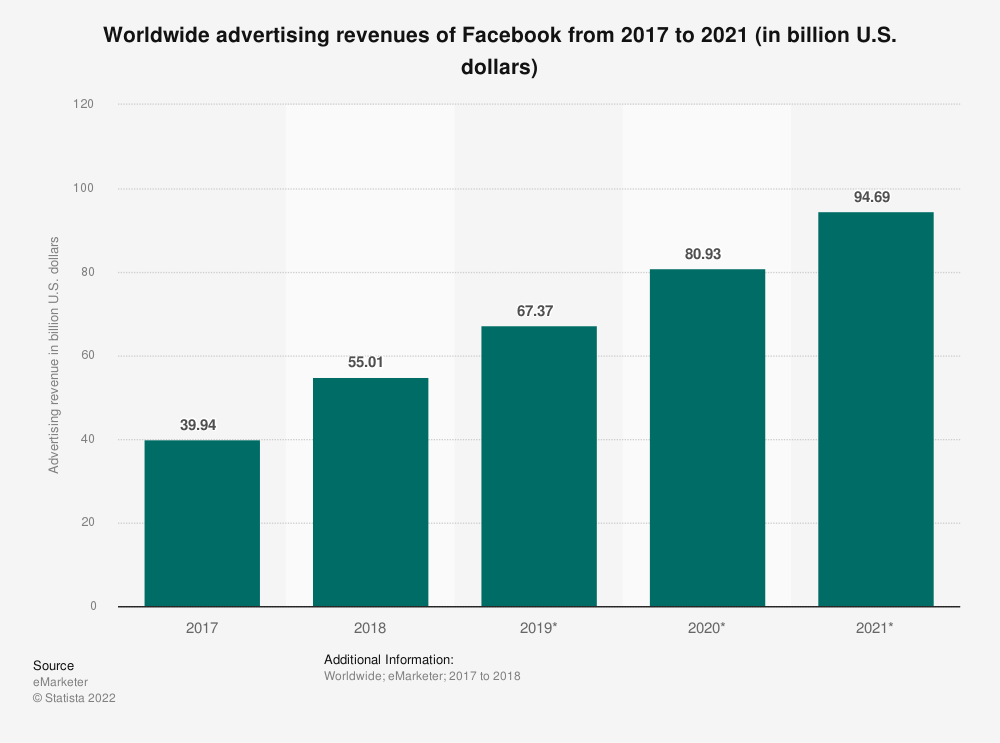
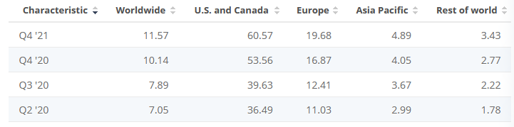
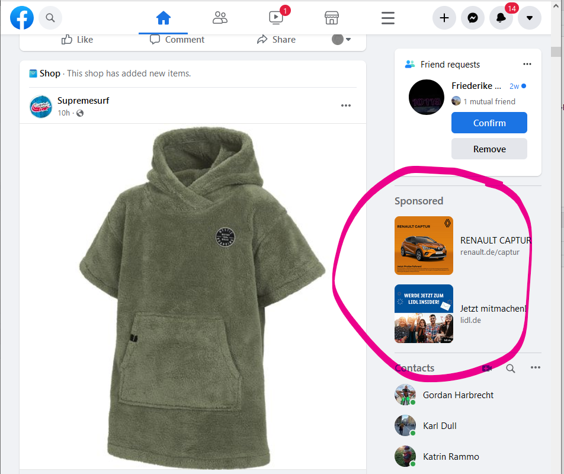
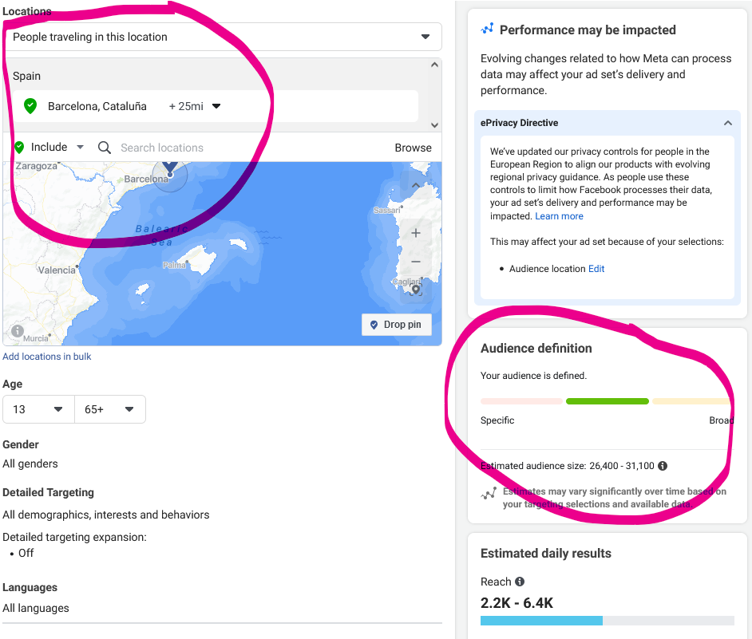

```{r setup, include=FALSE}
knitr::opts_chunk$set(echo = TRUE)
```

## Facebook Ads

Facebook earns almost all of its money by selling ads. Companies of all sizes
can buy ads that are served to Facebooks users.

```{r <metarevenue>, out.width='60%', fig.cap='Metas total advertising revenue. Source: Statista', echo=FALSE}

```


```{r <revenueperuser>, out.width='60%', fig.cap='Facebooks revenue.per user. Source: Statista', echo=FALSE}

```


```{r <facebookAd>, out.width='60%', fig.cap='Facebook ad example', echo=FALSE}

```

Metas advantage to other websites is not only its big reach, but also that it knows quite a lot
about its users. The users reveal quite a lot of information about themselves, 
often without consciously knowing it. Facebook employs many data scientists and 
machine learning engineers that sift through their already big data pool to 
derive secondary features (such as "interested in buying jewelry"). 
Marketeers who buy facebook ads, can use these features to target an ad only to 
a small group of people who really might be interested in their product.


### Create an Ad and get audience estimates through the Browser

We will now create an ad ourselves and play with the tools that Facebook offers
to get an intuitive understanding of it.

* Open your Browser and log in to Facebook

( * Create a Facebook Page (it is possible to create ads without a page, but it is more limited) )

* open the "Ads Manager"

* create a new campaign

* choose "traffic" (or anything, it doesn't matter since this does not affect the reach estimates)

* keep the defaults and click "next" on the bottom

* scroll to "Audience" and create a new audience


```{r <estimateGUI>, out.width='60%', fig.cap='Facebook ad audience estimates.', echo=FALSE}

```


**Exercise 3.1:** 
Play with the targeting GUI in the browser and read out some values:


* How many users live in a 25 Mile radius around Barcelona?
* How many of those speak German?
* How many users live in Spain?
* Now look at the detailed targeting --> Browse and click through some targeting criteria
 * How many users from Spain are in a long-distance-relationship?
 * find some strange targeting criteria! The student with the funniest audience wins!
* You can also exclude people based on the same criteria
 * How many users from Spain are in a long-distance-relationship AND have a relationship-status "complicated"?
 * How many users from Spain ARE in a long-distance-relationship AND NOT have a relationship-status "complicated"?


### Use R to get audience estimates

There are two ways to collect audience estimates with R:

* The official marketing API
* The 'unofficial' API, which is used by the web application GUI

We will:

* use our scraping-knowledge to reverse engineer and use the unofficial API
(* look how the official API works and automate the collection of facebook audience estimates.)
* use a newly released R-package that we can use to collect audience estimates


#### Reverse Engineering the audience estimates

Steps:

* Go to the admanager again and press F12 to open the developer-tools of your Browser
* Go to the network Tab
* Interact with the website to generate a new audience estimate. This will produce many requests to Facebook-servers. One of them must contain the audience estimate.
  * Hint: it must be a response with structured data. No PNG-image or js-file. Look for json-files. If there are several json-responses, look closer into the response data - Can you find the audience estimate numbers?
  * Hint 2: search for "estimate"
* Look at the request. We have to recreate the whole thing to get an answer from Facebook.
* right click on the request --> copy as cURL(POSIX)
* Paste the clipboard into this page: https://curlconverter.com/#r
* copy the code for R into a new R-script, or replace the next cell.


I had to manually edit the request a bit, because R was giving me errors:

* change `'Accept-Encoding' = 'gzip, deflate, br'` to `'Accept-Encoding' = 'gzip, deflate'`

(R apparently can't handle the br (brotli) compression)

Your access token will also look a bit different.

```{R, eval=FALSE}
require(httr)

headers = c(
  `User-Agent` = 'Mozilla/5.0 (Windows NT 10.0; Win64; x64; rv:97.0) Gecko/20100101 Firefox/97.0',
  `Accept` = '*/*',
  `Accept-Language` = 'de,en-US;q=0.7,en;q=0.3',
  `Accept-Encoding` = 'gzip, deflate',
  `Referer` = 'https://www.facebook.com/',
  `Content-type` = 'application/x-www-form-urlencoded',
  `Origin` = 'https://www.facebook.com',
  `Connection` = 'keep-alive',
  `Sec-Fetch-Dest` = 'empty',
  `Sec-Fetch-Mode` = 'cors',
  `Sec-Fetch-Site` = 'same-site',
  `Pragma` = 'no-cache',
  `Cache-Control` = 'no-cache',
  `TE` = 'trailers'
)

params = list(
  `access_token` = 'iHgBAMhMbKgEU3TTSTjYTGeluwcuvYaIhSZCSSqg39Ck5OkCI3371sDeBSiRMbss8j0ZBa8C7ATLlCgeb8qbuaFY0uxPsYjDNnLOvqalGoXBomO9bp0y3iF5F1Tz0FKYOvZCTHMq4jq1PpB4gZDZD',
  `__cppo` = '1',
  `__activeScenarioIDs` = '[]',
  `__activeScenarios` = '[]',
  `_app` = 'ADS_MANAGER',
  `_reqName` = 'adaccount/reachestimate',
  `_reqSrc` = 'AdsTargetingEstimatedReach.react',
  `_sessionID` = '3f11149a6',
  `include_headers` = 'false',
  `locale` = 'en_US',
  `method` = 'get',
  `pretty` = '0',
  `suppress_http_code` = '1',
  `targeting_spec` = create_targeting_spec(age_min = 30,age_max = 55,countries = c("ES")),
  `xref` = 'f342d65f52b39a6'
)

res <- httr::GET(url = 'https://graph.facebook.com/v12.0/act_663979760/reachestimate', httr::add_headers(.headers=headers), query = params)


```

```{R, eval=FALSE}
reply <-content(res,as="parsed")
reply$data$users
```
now you can inspect the reply-object to find out how to access the audience estimates:

```{R, eval=FALSE}

print(paste0("Mau (Monthly active users)",reply$data$users))
print(paste("Mau (Monthly active users, lower bound)",reply[["data"]][[1]][["estimate_mau_lower_bound"]]))
print(paste("Mau (Monthly active users, upper bound)",reply[["data"]][[1]][["estimate_mau_upper_bound"]]))
print(paste("Dau (Daily active users)",reply[["data"]][[1]][["estimate_dau"]]))
```

This should give you the same Monthly Active Users as in the the number from the webinterface.


### Change the targeting_spec to get a different result

The targeting spec defines our audience. Changes in the targeting spec will lead to changes in the audience estimates. Go to the previous long code chunk and change the targeting-spec. You could change the age or delete a requirement. But be careful that the targeting-spec stays valid json (parentheses must be closed, etc.).
Now you should get a different result.

This is an example targeting_spec:

```{R, eval=FALSE}
`targeting_spec` = '{"geo_locations":{"countries":["ES"],"location_types":["home"]},"age_min":18,"age_max":65,"publisher_platforms":["facebook","instagram","audience_network","messenger"],"facebook_positions":["feed","instant_article","instream_video","right_hand_column","video_feeds","marketplace","story","facebook_reels_overlay","search","groups_feed"],"instagram_positions":["stream","story","explore","reels","shop"],"messenger_positions":["messenger_home","story"],"device_platforms":["mobile","desktop"],"audience_network_positions":["classic","rewarded_video"],"oculus_positions":[],"excluded_publisher_list_ids":[],"user_device":[],"excluded_user_device":[],"user_os":[],"wireless_carrier":[],"targeting_optimization":"none","exclusions":{"behaviors":[{"id":"6086568164383","name":"Marketing API developers (last 90 days)"},{"id":"6063136545383","name":"Android: 360 degree media supported"}]},"flexible_spec":[{"life_events":[{"id":"6003053984972","name":"Long-distance relationship"}]}],"brand_safety_content_filter_levels":["FACEBOOK_STANDARD","AN_STANDARD"],"excluded_brand_safety_content_types":[]}'
```

if we format it, it looks like this:

```JSON
`targeting_spec` = `{
  "geo_locations": {
    "countries": [
      "ES"
    ],
    "location_types": [
      "home"
    ]
  },
  "age_min": 18,
  "age_max": 65,
  "publisher_platforms": [
    "facebook",
    "instagram",
    "audience_network",
    "messenger"
  ],
  "facebook_positions": [
    "feed",
    "instant_article",
    "instream_video",
    "right_hand_column",
    "video_feeds",
    "marketplace",
    "story",
    "facebook_reels_overlay",
    "search",
    "groups_feed"
  ],
  "instagram_positions": [
    "stream",
    "story",
    "explore",
    "reels",
    "shop"
  ],
  "messenger_positions": [
    "messenger_home",
    "story"
  ],
  "device_platforms": [
    "mobile",
    "desktop"
  ],
  "audience_network_positions": [
    "classic",
    "rewarded_video"
  ],
  "oculus_positions": [],
  "excluded_publisher_list_ids": [],
  "user_device": [],
  "excluded_user_device": [],
  "user_os": [],
  "wireless_carrier": [],
  "targeting_optimization": "none",
  "exclusions": {
    "behaviors": [
      {
        "id": "6086568164383",
        "name": "Marketing API developers (last 90 days)"
      },
      {
        "id": "6063136545383",
        "name": "Android: 360 degree media supported"
      }
    ]
  },
  "flexible_spec": [
    {
      "life_events": [
        {
          "id": "6003053984972",
          "name": "Long-distance relationship"
        }
      ]
    }
  ],
  "brand_safety_content_filter_levels": [
    "FACEBOOK_STANDARD",
    "AN_STANDARD"
  ],
  "excluded_brand_safety_content_types": []
}`
```

If we want to automate the collection of data, we need many targeting-specs. I built a function that creates targeting-specs based on a few input-variables:

```{R, eval=FALSE}

create_targeting_spec <- function(age_min = 18,age_max = 65,countries = c("ES","DE","FR"),only_expats=FALSE,gender=1){
  
  # The facebook_stuff will always stay the same:
  facebook_stuff <- '
  "publisher_platforms": [
    "facebook",
    "instagram",
    "audience_network",
    "messenger"
  ],
  "facebook_positions": [
    "feed",
    "instant_article",
    "instream_video",
    "right_hand_column",
    "video_feeds",
    "marketplace",
    "story",
    "facebook_reels_overlay",
    "search",
    "groups_feed"
  ],
  "instagram_positions": [
    "stream",
    "story",
    "explore",
    "reels",
    "shop"
  ],
  "messenger_positions": [
    "messenger_home",
    "story"
  ],
  "device_platforms": [
    "mobile",
    "desktop"
  ],
  "audience_network_positions": [
    "classic",
    "rewarded_video"
  ],
  "oculus_positions": [],
  "excluded_publisher_list_ids": [],
  "user_device": [],
  "excluded_user_device": [],
  "user_os": [],
  "wireless_carrier": [],
  "targeting_optimization": "none",
  "brand_safety_content_filter_levels": [
    "FACEBOOK_STANDARD",
    "AN_STANDARD"
  ],
  "excluded_brand_safety_content_types": []
  ' 
  
  geo_locations_begin <- '
  "geo_locations": {
    "countries": ['
    
  geo_locations_end <-'],
    "location_types": [
      "home"
    ]
  }'
  
  # countries = c("ES","DE","FR")
  countries_string <- paste0('"',countries,'"',  collapse=',')
  geo_locations_string <- paste0(geo_locations_begin,countries_string,geo_locations_end)
  #geo_locations_string
  
  age_string <- paste0('"age_min":',age_min,',"age_max":',age_max)
  
  # paste it all together:
  
  if (only_expats==TRUE) {
    other_stuff <-'"flexible_spec":[{"behaviors":[{"id":"6015559470583","name":"Lives abroad"}]}]'
    targeting_spec = paste0("{",geo_locations_string,",",facebook_stuff,",",age_string,",",other_stuff,"}")
  } else {
    targeting_spec = paste0("{",geo_locations_string,",",facebook_stuff,",",age_string,"}")
  }
  
  # strwrap can removes the linebreaks if we set simplify=TRUE:
  targeting_spec <- strwrap(targeting_spec, width=30000, simplify=TRUE)
  # replace all spaces with nothing:
  targeting_spec <- gsub(" ","",targeting_spec)
  
  # return the result of this function:
  return(targeting_spec)
}
print(create_targeting_spec(countries=c("ES"),only_expats = TRUE))
tarspec = create_targeting_spec(countries=c("ES"))
```

Now let's create a new request and replace the targeting spec with our self-generated targeting-spec and see whether Facebook gives us a reasonable response. Copy your own code from above here again and then edit the line with the targeting-spec. Remove the string of the targeting-spec and insert the function.

```{R}


```


## No reverse engineering: Looking at the official documentation and doing it right!

    
### How to create an App and get a token:

* create a developer account here: https://developers.facebook.com/
* Then go to "My Apps": top bar, right. left of the search bar: "My Apps"
* "Create App"
* Select "Business App"
* give it a name (e.g. "EDSDAPP")
* We have an app!
* Now: Add the Marketing API
  * scroll Down (or go to "Dashboard" and then scroll down) to "Add products to your app"
  * "Marketing API" --> "Set up"
  * Left Menu --> Tools
  * Check "ads management"
  * "Get token"
  * Copy the token, paste it here into the code.
  * Also copy the App-ID
  

```{r <inspect>, out.width='90%', fig.cap='', echo=FALSE}
#knitr::include_graphics('./images/get_token2.png')
```

save your token and App Id here:
```{R, eval=FALSE}
ftoken <- "EAATi8YeQqs0BAFzUE8P3WvZBfAMc5tdknnum2P5IU1isF2eIjBCugGIsUEXhlxdypemy5qFe4Y2KQxAOZAzCVjBNDyqeZBQxqhb791dEsIYXE6sFMYrLUCD8YnIxCQ6OVlmwqDEilfK35juqe7zuGmHxZBu8cGiQUdZAzQtIZCrejylySOdPSD"
fappid <- "1375426896243405"

sandboxtoken = "EAATi8YeQqs0BAOeRZAnE5dcCiuq41Jr6ZBOHKHiTAlvZCZBeNfeKeLTVzKFu0K6h6bdzFZAQItZAGZAzyx61SXeNqaeE2VKm7zqgRzfAZBUba0Gt09zqGyfvdVdFOeaeEtuPSBz3QZCV7kQUXv6MaMQtDLWtZAtryC5xG4ZCNZBYClZCQeWFfRRjXZCRMW7ZC77pfbbTxwZD"
ftoken = sandboxtoken


oldtoken = "EAAGPAKIqBW8BABdgSWTjCuhIz7hwu5IRzRGoPBaOVWcxZBHx1Ey9zaNn7PiFAi8ej6hZAjZAGt4Ip4k11qdmD8jJwIIbZAW9v2TGHZAIYuZAZBu3nkzwGChkMxRMYPre2mosZCeLIYZCTKneaOcamUC9zEUBrF8dktvZCZBLjyZCZA2WU0wVJfvzsu7XZC"

oldfappid1 = "438707860145519"


ftoken = oldtoken
fappid = oldfappid1


ftoken <- "EAABsbCS1iHgBAHtEcSWyPZAzBmjJM8MhMbKgEU3TTSTjYTGeluwcuvYaIhSZCSSqg39Ck5OkCI3371sDeBSiRMbss8j0ZBa8C7ATLlCgeb8qbuaFY0uxPsYjDNnLOvqalGoXBomO9bp0y3iF5F1Tz0FKYOvZCTHMq4jq1PpB4gZDZD"
fappid <-"660797563979760"


```

While Twitter has only a few endpoints in its API, Facebook has many different APIs and endpoints.
This makes things a bit harder. Their examples are not in R but only in other languages... but we can use curlconverter.com or https://onlinedevtools.in/curl to convert the examples to R. 

We use the Marketing API:
https://developers.facebook.com/docs/marketing-apis/get-started

And in the Marketing API the audiences:
https://developers.facebook.com/docs/marketing-api/audiences/reference

But the documentation doesn't really tell us what to do. 


```{R, eval=FALSE}
library(tidyverse)
library(jsonlite)


version="v13.0" 
    
Credentials=paste0('https://graph.facebook.com/',version,'/act_',fappid,'/delivery_estimate?access_token=',ftoken,'&include_headers=false&method=get&optimization_goal=REACH&pretty=0&suppress_http_code=1')

Age1=25
Age2=55

g=1 # 1:men and 2:women

C='"DE"' # Country code


query <- paste0(Credentials,'&targeting_spec=',create_targeting_spec(countries=c("ES")))


(query_val<-url(query)%>%fromJSON)
query_val$data$estimate_mau

require(httr)


res <- httr::POST(url = paste0('https://graph.facebook.com/v13.0/act_',fappid,'E/adsets'), body = files)

res

```


```{R, eval=FALSE}

make_request_and_get_mau <- function(tarspec) {
  
  version="v13.0" 
      
  Credentials=paste0('https://graph.facebook.com/',version,'/act_',fappid,'/delivery_estimate?access_token=',ftoken,'&include_headers=false&method=get&optimization_goal=REACH&pretty=0&suppress_http_code=1')
  
  
  query <- paste0(Credentials,'&targeting_spec=',tarspec)
  
  
  query_val<-url(query)%>%fromJSON
  filename= paste0("facebook_audience",gsub(":", "_", as.character(Sys.time())),"_",".RDS")
  saveRDS(query_val, filename)
  
  
  return(query_val$data$estimate_mau)
}

```


## Prepare a collection-loop and save the results

Creating a single request is definitely easier in the GUI, but we want to make hundreds and thousands of requests. 
Therefore, we loop over inputs to generate new targeting-specs and request the results from Facebook.

```{R, eval=FALSE}

agegroups = list(c(18,65))#,c(18,39),c(40,65))
countries = c('AL', 'AD', 'AM', 'AT', 'BY', 'BE', 'BA', 'BG', 'CH', 'CY', 'CZ', 'DE', 'DK', 'EE', 'ES', 'FO', 'FI', 'FR', 'GB', 'GE', 'GI', 'GR', 'HU', 'HR', 'IE', 'IS', 'IT', 'LI', 'LT', 'LU', 'LV', 'MC', 'MK', 'MT', 'NO', 'NL', 'PL', 'PT', 'RO', 'RS', 'RU', 'SE', 'SI', 'SK', 'SM', 'TR', 'UA')
#countries = c('ES', 'DE','US')

flexible_specs=c(
'"flexible_spec":[{"behaviors":[{"id":"6015559470583","name":"Lives abroad"}]}]',
'"flexible_spec":[{"behaviors":[{"id":"6019367052983","name":"Lived in Germany (Formerly Expats - Germany)"}]}]', '"flexible_spec":[{"behaviors":[{"id":"6021354152983","name":"Lived in UK (Formerly Expats - UK)"}]}]', '"flexible_spec":[{"behaviors":[{"id":"6019367014383","name":"Lived in France (Formerly Expats - France)"}]}]', '"flexible_spec":[{"behaviors":[{"id":"6019367014383","name":"Lived in France (Formerly Expats - France)"}]}]', '"flexible_spec":[{"behaviors":[{"id":"6019367014383","name":"Lived in France (Formerly Expats - France)"}]}]'
)
with_expats_list = c(TRUE,FALSE)

listall = list()
mm =matrix(1:length(agegroups)*length(countries)*length(with_expats_list)*6, nrow = length(agegroups)*length(countries)*length(with_expats_list), ncol = 6)
i = 0
for (agegroup in agegroups) {
  
  print("-----")
  print(agegroup)
  for (country in countries) {
    for (with_expats in with_expats_list) {
      Sys.sleep(0.3)
      i <- i + 1
      #print(country)
      #print(agegroup[1])
      #print(agegroup[2])
      tarspec = create_targeting_spec(age_min = agegroup[1],age_max = agegroup[2], countries = country, only_expats = with_expats)
      
      print(paste0("fetching, ...",i, " ", country, agegroup[1], agegroup[2]))
      mau = make_request_and_get_mau(tarspec)
        
  
      mm[i,1] = country
      mm[i,2] = agegroup[1]
      mm[i,3] = agegroup[2]
      mm[i,4] = tarspec
      mm[i,5] = with_expats
      mm[i,6] = mau
    
    }
  }
}
mm
dfmm = data.frame(mm)
names(dfmm) = c("country","agemin","agemax","tarspec","with_expats","mau")
write.csv(dfmm,file="facebook_audience_estimates_1.csv")
```

### Plot the results versus World Bank data

```{R, eval=FALSE}
dfmm

library(WDI)

WDIsearch("migrant")

wdi_migrantstock_share <-WDI::WDI(country=countries, indicator = "SM.POP.TOTL.ZS",latest=1)
wdi_migrantstock_share
```


```{R}
dffacebook = dfmm %>%
  group_by(country) %>%
  summarize(
    expat_numbers_facebook = min(as.numeric(mau)),
    expat_numbers_facebook_str = min(mau),
    total_users_facebook = max(as.numeric(mau)),
    total_users_facebook_str = max(mau),
  ) %>%
  transform(
    expat_share_facebook = expat_numbers_facebook / total_users_facebook
  )

#dffacebook$expat_share_facebook = dffacebook[expat_numbers_facebook] / dffacebook[[total_users_faceook]]
#dffacebook[, "expat_share_facebook"] <- (dffacebook[, "expat_numbers_facebook"] / dffacebook[, "total_users_faceook"])
#d <- mutate(dffacebook, new = expat_numbers_facebook / total_users_faceook)

```


################################################################################

# Rsocialwatcher - The easy way

Robert Marty, a researcher at the world bank has released an R-package that
simplifies the collection of Facebook audience estimates.

https://worldbank.github.io/rsocialwatcher/


```{R}

install.packages("devtools")
devtools::install_github("worldbank/rsocialwatcher")
library(rsocialwatcher)
library(dplyr)
```

### Facebook Access token

Either you have it already or you can follow the description on this site on
how to obtain the correct access token:
https://worldbank.github.io/rsocialwatcher/articles/create_facebook_credentials.html

I borrowed a lot of code here from their documentation at https://worldbank.github.io/rsocialwatcher/


```{R}
# Define API version, creation act & token -------------------------------------
VERSION      <- "[ENTER HERE]" # Example: "v20.0"
CREATION_ACT <- "[ENTER HERE]"
TOKEN        <- "[ENTER HERE]"

VERSION = "v20.0"
CREATION_ACT = "660797563979760"
TOKEN = "EAATi8YeQqs0BO4aldZC5tIF5Pco1EnqzH7cjUsEZCwqA8qHXjDChvElRb1hcNgTeFD8bsI57OizEUihGy3ZC4asyDuDRN2uDkNe9tZACCAM5ZBIEtCoh0Q2Xt4fxqP4OvJZCmnMMWwxE4bCLQFMzURd3oDgQjY1tXOdMGgX3ZAHSbggIoZCp9LZBtHsZAs7Yp2xzy3jvZC3doCN7bdwWLOI"

```


```{R}
# Get dataframe of Facebook parameter IDs and descriptions ---------------------
## Interests and behaviors
interests_df <- get_fb_parameter_ids("interests", VERSION, TOKEN)
behaviors_df <- get_fb_parameter_ids("behaviors", VERSION, TOKEN)

# filter for behaviors with "lived" as part of the name, anywhere in the string
behaviors_filtered <- behaviors_df |> 
  filter(grepl("lived", name, ignore.case = TRUE))


head(behaviors_filtered[,1:6])
```


```{R}
## Locations: countries
country_df <- get_fb_parameter_ids("country", VERSION, TOKEN)

head(country_df)
```


```{R}
us_key <- country_df |> 
  filter(name == "United States") |> 
  pull(key)

query_fb_marketing_api(
  location_unit_type = "countries",
  location_keys      = us_key,
  version            = VERSION, 
  creation_act       = CREATION_ACT, 
  token              = TOKEN)
#>   estimate_dau estimate_mau_lower_bound estimate_mau_upper_bound
#> 1    219899444                234900000                276400000
#>   location_unit_type location_types location_keys gender age_min age_max
#> 1          countries home or recent            US 1 or 2      18      65
#>     api_call_time_utc
#> 1 2024-05-04 17:03:38
```

```{R}
beh_lived_spain <- behaviors_df |> 
  filter(grepl("lived in Spa", name, ignore.case = TRUE)) |> 
  pull(id)
beh_lived_spain
beh_lived_germany <- behaviors_df |> 
  filter(grepl("lived in ger", name, ignore.case = TRUE)) |> 
  pull(id)
beh_lived_germany
beh_lived_pol <- behaviors_df |> 
  filter(grepl("lived in Pol", name, ignore.case = TRUE)) |> 
  pull(id)
beh_lived_pol

query_fb_marketing_api(
  location_unit_type = "country",
  location_keys      = "FR",
  behaviors          = beh_lived_spain,
  version            = VERSION,
  creation_act       = CREATION_ACT,
  token              = TOKEN)
#>   estimate_dau estimate_mau_lower_bound estimate_mau_upper_bound
#> 1     13957411                 14100000                 16600000
#>   location_unit_type location_types location_keys     behaviors gender age_min
#> 1          countries home or recent            US 6003808923172 1 or 2      18
#>   age_max   api_call_time_utc
#> 1      65 2024-05-04 17:03:52
```


## Map Over Multiple Queries

Putting parameters in the map_param function results in the
query_fb_marketing_api function making multiple queries.

Example: Make queries for different countries.
```{R}
country_df |> 
  filter(name %in% c("Germany", "Spain", "Poland")) |> 
  pull(key)

fresult <- query_fb_marketing_api(
  location_unit_type = "country",
  location_keys      = map_param("DE", "ES", "PL"),
  behaviors          = map_param(beh_lived_germany, beh_lived_spain,beh_lived_pol),
  version            = VERSION,
  creation_act       = CREATION_ACT,
  token              = TOKEN)

fresult

```

```{R}
# write results to a csv file
write.csv(fresult, "facebook_audience_estimates_es_de_po.csv")

```

```{R}

```

```{R}

```
