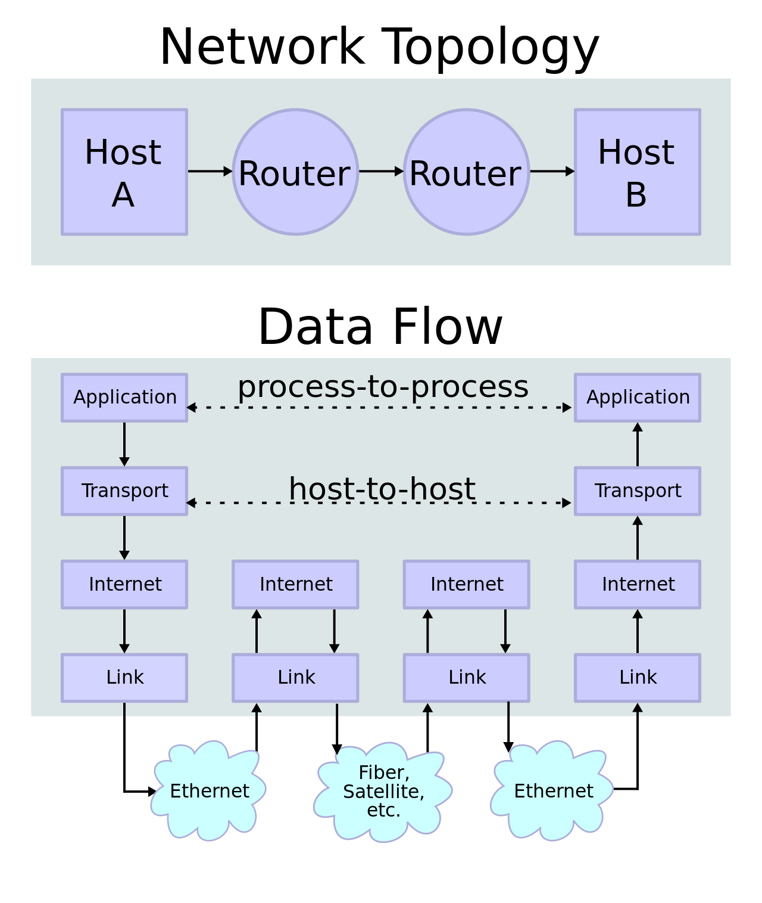
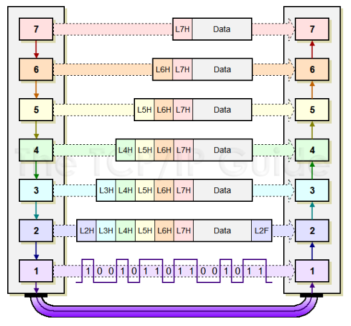
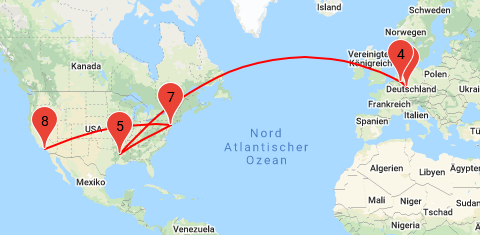
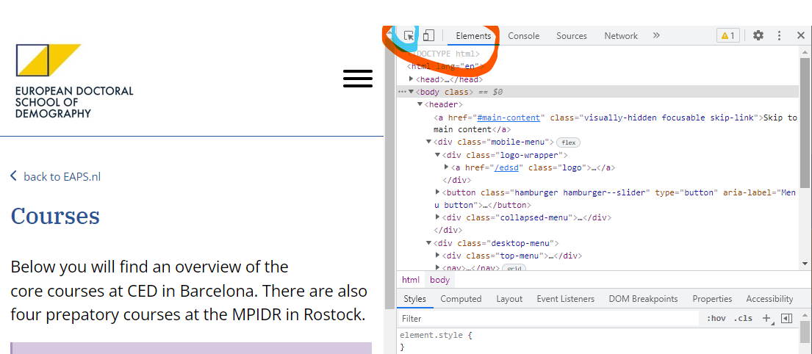
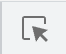
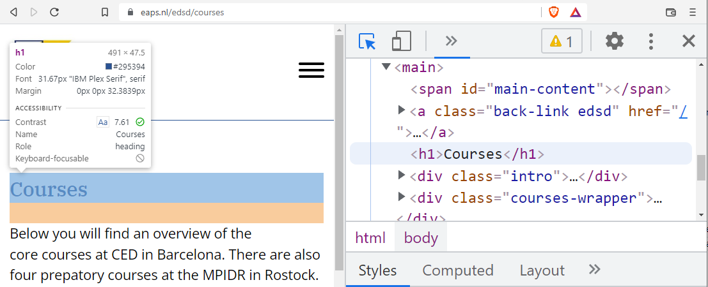

```{r setup, include=FALSE, warning=FALSE}
pagebreak <- function() {
  if(knitr::is_latex_output())
    return("\\newpage")
  else
    return('<div style="page-break-before: always;" />')
}

knitr::opts_chunk$set(warning = FALSE, message = FALSE) 
```


----------------
 
* Day 1 - Introduction to "Extracting data from the web" & scraping HTML
  * Introduction
    * What is the internet and how does it work? (Servers, browsers, protocols)
    * Overview of all practical ways to get data (Web scraping, accessing APIs, downloading big files, accessing DBs directly, other ways)
    * Possibilities and limitations 1
      * technical
      * ethical
      * legal 
  * Scraping HTML
    * How are websites build, what is HTML, how to extract data from HTML
    * Best practices for storing data
    * Hands-on practice: scraping HTML

----------------

## What is the Internet, what is the world wide web and how does that work?

Most of you probably know this already, but I will start from the ground up in case anyone doesn't know.

The internet is a set of layers of protocols and standards that are used to exchange data between computers over the whole world.
The topmost layer the application-layer, which, in the case of the world-wide-web, is the HTTP protocol. 
The HTTP protocol is used by browsers and Servers to exchange data and display web pages.
It can also be the SMTP-protocol, which is used to send, receive and store e-mails by email programs and servers.
On the sending side, each protocol takes a chunk of data, appends a header and hands that chunk to the next layer.
The header tells each handler what to do with the chunk of data.

That was quite abstract, let's work through an example.

<!--{width=50%} -->


### What happens when I visit a website?

Please open a Browser and enter the URL of one of your favorite websites. If everything works fine,
in less than a few seconds you will see formatted text, images and maybe more on your screen.
On some websites, you have the ability to create an account, log in and then send messages to other users or make purchases or do basically anything.

Let's see what exactly happens to make this happen.


#### Enter a website, make a request

After you enter a domain name (e.g. "www.demogr.mpg.de") into your browser, your browser creates a http-request for you.
And because you don't want to send any particular data to the server yet, the requests is only a http-header without more content to it.


A request from a Browser looks like this:
```
GET /de HTTP/1.1
Host: www.demogr.mpg.de
User-Agent: Mozilla/5.0 (Windows NT 10.0; Win64; x64; rv:96.0) Gecko/20100101 Firefox/96.0
Accept: text/html,application/xhtml+xml,application/xml;q=0.9,image/avif,image/webp,*/*;q=0.8
Accept-Language: de,en-US;q=0.7,en;q=0.3
Accept-Encoding: gzip, deflate, br
Connection: keep-alive
Upgrade-Insecure-Requests: 1
Sec-Fetch-Dest: document
Sec-Fetch-Mode: navigate
Sec-Fetch-Site: none
Sec-Fetch-User: ?1
Pragma: no-cache
Cache-Control: no-cache
```

{width=50%}


This is what the server at www.demogr.mpg.de receives. It tells the server that we want to `GET` 
whatever there is on www.demogr.mpg.de using the HTTP protocol in the version 1.1. It also tells
the server that "we" are a Firefox browser on Windows 10 and then what we accept (which file formats, what languages,
which compression algorithms, etc.).


The server will then send an answer back to us which includes a response-header and a response-content.
The header contains information about the status of the request and the content contains the actual data.
Luckily, we got a status code 200, which means that everything went fine.

````
HTTP/2 200 OK
cache-control: private
content-type: text/html; charset=utf-8
server: Microsoft-IIS/10.0
x-aspnet-version: 4.0.30319
x-powered-by: ASP.NET
strict-transport-security: max-age=31536000
date: Thu, 10 Feb 2022 16:38:24 GMT
content-length: 91546
X-Firefox-Spdy: h2
````
The content, a html-file:
```{html}
<!DOCTYPE html>
<html lang="de">

<head><meta charset="utf-8" /><meta name="viewport" content="width=device-width, initial-scale=1.0, user-scalable=yes, maximum-scale=2.0" /><title>
	MPIDR - Startseite
</title><meta http-equiv="X-UA-Compatible" content="IE=10" /><meta http-equiv="imagetoolbar" content="false" /><link href="/Content/css?v=S3GxTH8gJ5D7Bqu4IF0SrCZqphQ4uN_qMd4Y7JDUEqE1" rel="stylesheet"/>
<script src="/bundles/BootstrapJs?v=ukQO9O0W61_xRcVjXrbaGA4wMNWpnPi4rv0royS0lME1"></script>
```

After the browser received the content, it starts to parse it. During this process, it will do two things:
* look for linked resources that need to be downloaded (e.g. images, css-files, javascript-files) and then send a request for every single resource on the page. This can be hundreds for a modern website.
* read the content and figure out how to display it on the screen.

...and finally, you can look at your screen and enjoy the content or click on links which will start the whole process from the beginning.


### What happens between your browser and the server, how does the data get to the right place?

#### Connect your computer to the internet

In order to use the internet, you have to connect to it. Today this most often means
that your device is connected to a router over wi-fi. That router has to be connected to an internet
service provider (ISP). The ISP in turn has many routers that are connected to the routers of other ISPs and
to the routers of server-providers (e.g. Google, Amazon, Hetzner, etc.).

#### Ask your Domain Name Server (DNS) for the IP-address of the server

The routers work with IP-Addresses. IP-Addresses are like a unique identifier for every computer on the internet (think: telephone-numbers).
A Domain Name Server (DNS) has a table of domain names and their IP-Addresses. If you ask
the DNS for the IP-address of a domain name, it will tell you the IP-address of the server that is responsible for that domain name.
 (e.g. "mpidr.de" is resolved to the IP-address "195.37.34.73").

Now that your router knows the IP-address of the domain name, it can send the request of the Browser to the IP-address to fetch the data. 
But your router has no idea where exactly that IP address is, so it routes your request to a router of your ISP. That router will have a table of IP-address-ranges and corresponding routers (think: the IP address starts with 195.37? that is probably somewhere in Germany, the router is going to route it to a router that might know more about the place. And that router does the same thing until it arrives at the correct server.)

```{r layers, out.width='49%', fig.cap='Internet Layers', echo=FALSE}

```

```{r layers and headers,out.width='49%', fig.cap='Internet Layers and headers', echo=FALSE}

```


We can use traceroute (on Linux) or tracert (on Windows) to see all the routers that are hops on the journey from your Browserto the correct server:

```
traceroute example.com

tracert example.com
tracert demogr.mpg.de
```

and then visualize the result with a traceroute-map:
https://stefansundin.github.io/traceroute-mapper/

```{r <routers between the MPIDR and example.com >,out.width='49%', fig.cap='routers between the MPIDR and example.com', echo=FALSE}

```


## Overview of different techniques for extracting data from the web

### Other Protocols than HTTP
Websites and the world wide web are not the only things you can do with the internet.
There are emails. Voice over IP. Telnet. Newsgroups. File-Transfer-Protocol (FTP). And so on. But most of the traffic today is done via HTTP(S). But HTTP is not only used to transfer HTML-files. It is also used to transfer data like images, css-files, javascript-files, etc. It is also used to transfer APIs and it is used outside the browser by mobile apps or desktop applications.

### Different ways to get data from the web


* Scraping HTML
* Accessing APIs
* Downloading big files
* Accessing DBs directly

#### Scraping HTML

Downloading Websites and extracting some data from it.
More on that later today.

#### Accessing APIs

Application Programming Interfaces (APIs) are interfaces of programs that can be used by other programs to communicate with each other. In the context of the Internet, APIs are "websites for machines". They have a well-defined structure which makes it easy (not always!) to access the data.

We will learn more about APIs on Wednesday (Twitter and others) and Thursday (Facebook).
Question: Has anyone used APIs before? How much do you know about accessing e.g. Facebook audience estimates? How much more do you want to learn?


#### Downloading big files

Some institutions provide data in the form of big data files. These files can be downloaded and then processed offline by your computer. The data can be stored in a variety of different formats (comma seperated value-files, Excel-files, XML-files, etc.).

We will work with such data on Tuesday.

#### Accessing DBs directly

Sometimes you can gain direct access to certain databases. Then you can connect to the database over a special connection and query the database directly, often with the query language SQL.
This is not very common, but it is possible. We will not cover this in this course.


`r pagebreak()`

# Scraping Websites with R and RVest

A webpage in its simplest form is just a file containing HTML code.

Example of a minimal webpage:
```
<!DOCTYPE html>
<html>
  <head>
    <title>My webpage</title>
  </head>
  <body>
    <h1>Hello, Barcelona!</h1>
  </body>
</html>
```

But usually, modern webpages are more complex. They can contain images, videos, forms, interactive elements, scripts, etc..
You can have a look at the source code of every webpage by visiting it in your browser and hitting `ctrl + U` (or `cmd + U` on Mac).

Visit [https://eaps.nl/edsd/courses/](https://eaps.nl/edsd/courses/) (or any other website that you visit regularly) and look at the source code to get an idea of what the code of a typical website looks like.
You will quickly realize, that it is a lot of HTML code for a modest page. When we later want to extract a specific piece of information from the webpage, we will need to find the HTML code that contains that information.

Thankfully, modern browsers include tools to inspect the HTML code of a webpage while simultaneously marking the corresponding elements in the webpage:
 * press `ctrl + shift + i` (or `cmd + shift + i` on Mac)  --> this opens the developer tools
 * In Chrome, click on the "Elements"-tab; In Firefox, click on the "Inspector"-tab
  * If you can't find it, look for the red circle in the screenshot below

```{r HTML-Inspektor, echo=FALSE, out.width='100%', fig.cap='Developer Tools'}

```

```{r <inspect>, out.width='60px', fig.cap='', echo=FALSE}

```
After clicking on the small icon, the webpage-view and the code-view are linked. Hovering over an element in the webpage-view will highlight the corresponding element in the code-view.
This is not only great for learning a bit of HTML, it is very valuable later when you have to locate the exact place where a desired element is located in the HTML.

```{r <label>, out.width='80%', fig.cap='Inspector', echo=FALSE}

```

Important for us is, that we can use R (or any other programming language) to download all these files and extract the data we want. All we need to know, is the address of the webpage and the name or position of the element we want to extract.

### CSS

CSS (Cascading Style Sheets) defines the appearance of HTML elements. CSS selectors are often used to style particular subsets of elements, but you can also use them to extract elements from a web page.

CSS selectors often reflect the structure of the web page. For example, the CSS selector for the example page heading is

```css
body > h1
```
and the selector for the entire table is
```css
body > table
```

Websites use it to apply style to certain elements on the site.
Consider this css-example from the website https://eaps.nl/edsd

```{css}
main > h1, .home-header > h1 {
  font-family: var(--font-family-serif);
  font-weight: 500;
  color: var(--color-blue);
  font-size: var(--step-2);
  margin-bottom: var(--space-m);
}

```

`main > h1` selects all the h1-tags (headlines) that are children of the "main"-tag.
Then the stuff between the curly braces defines the font, size and look of the headline.


You don’t need to generate CSS selectors yourself, because in most cases
the bookmarklet https://selectorgadget.com/ can be used to create them easily.

Please install [SelectorGadget](https://selectorgadget.com/) in your Browser.

## Reading a website with R

Requesting webpages can be done not only by using the webbrowser, but also by using any programming language. We will use R to do this. And we will use the R-package `rvest`, because it makes this very convenient.

Please google rvest, and you will get the installation-instructions:

```R
# The easiest way to get rvest is to install the whole tidyverse:
install.packages("tidyverse")

# Alternatively, install just rvest:
install.packages("rvest")
```
(Probably you already had to install tidyverse for the other modules)

Now you can download any webpage with the simple command `read_html`:

```{r}
library(rvest)
simple_page <- read_html("https://user.demogr.mpg.de/theile/Files/edsd/simple.html")
print(paste(simple_page))
```

```
<!DOCTYPE html>
<html>
<body>

<h1>Hello Barcelona!</h1>

<p>This is some text.</p>

<a href="https://www.example.com">This is a link</a>
<a href="./simple2.html">This is also a link</a>
</body>
</html>
```

**Exercise 1.1:** Download the Website https://eaps.nl/edsd and store it in a variable
(The solution is in the Rmd-source file of this document)


```{R, echo=FALSE}

page_edsd <- read_html("https://eaps.nl/edsd")

```

**Exercise 1.2:** Print the headlines from that page to the console.


```{R,echo=FALSE}

# use selectorGadget to find the css selector:
css_selector <-"h1"

headlines <- page_edsd %>%
    html_nodes(css_selector) %>%   # This line selects all the html-elements with that css-selector
    html_text()   # This extracts only the Text of the selected html-elements

print(headlines)

```


**Exercise 1.2:** Now print all the headlines of the core courses on this page: https://eaps.nl/edsd/courses

```{R}
# use selectorGadget to find the css selector:
css_selector <-"h2"

page_courses <- read_html("https://eaps.nl/edsd/courses")

headlines <- page_courses %>%
    html_nodes(css_selector) %>%   # This line selects all the html-elements with that css-selector
    html_text()   # This extracts only the Text of the selected html-elements

print(headlines)

```

**Exercise 1.3 (hands-on):** Scrape the headlines from a popular news-website of your choice!

```{R, echo=FALSE}
library(dplyr)
library(rvest)

news_url = "https://www.washingtonpost.com/"
news_selector = ".left.relative , .left.relative span, .center.relative span, .left.relative span"
news_name ="washingtonpost"

result_folder <- "D:/dev/r/EDSD_2022_working_with_digital_data/day1_internet_and_scraping/data/"
  
# load the page from the internet:
news_page <- read_html(news_url)

# save the page to a file:
filename= paste0(result_folder,gsub(":", "_", as.character(Sys.time())),"_",news_name,".RDS") #create a filename that includes the date and time. replace":" with "_"
print(paste0("just scraped: ", filename, news_name))
saveRDS(news_page, filename)

headlines <- news_page %>%  
  html_nodes(news_selector) %>%  #select the headline-tags
  html_text() # extract the text
head(unique(headlines))


# We can also extract all the links to the articles behind the headlines with the following code:
links <- news_page %>%
  html_elements(news_selector) %>% 
  html_elements("a") %>% 
  html_attr('href')
head(links)

# Create a dataframe from all the data (please note that we didn't really need the two blocks before):
dflinks <- data.frame(
  headline = news_page %>% html_nodes(news_selector) %>% html_text(),
  links = news_page %>% html_nodes(news_selector) %>% html_node("a") %>% html_attr("href"), #instead of extracting the text, we extract the link-tag <a href="https:\\......">text</a> and extract the href-attribute
  scrapetime =Sys.time(),
  shortname = news_name
)

dflinks2 <- dflinks %>% 
  filter(!is.na(links)) %>% #remove rows without links
  group_by(headline) # remove duplicate headlines

knitr::kable(head(dflinks2), caption = "Headlines 4")

```

### Question: Do you have ideas for scraping, or problems that could be solved by scraping websites?

```{R}


```


## Legal issues: Are we allowed to scrape? What is considered okay or not okay?

[Wikipedia](https://en.wikipedia.org/wiki/Web_scraping#Legal_issues) gives a short overview of some court cases.
I am not a legal expert, but I can share some of the "wisdom" I learned so far:

 * For most owners of webpages, it is fine to scrape their site, as long as you "behave"
   * "Behaving" means: 
     * You don't induce interruptions or costs to their service by scraping too fast or too much (good rule of thumb: only scrape one domain every 2 seconds)
     * You don't use the data to the disadvantage of the scraped site. Since content is often copyrighted, you are mostly not allowed to share your scraped data publicly. (Exemption: you alter or aggregate the data enough)
     * You respect their [robots.txt](https://en.wikipedia.org/wiki/Robots_exclusion_standard)
 * For other website owners or purposes, it is not okay - but you are probably still allowed to scrape it!
   * A US court ruled, that LinkedIn had to remove technical measures that prevented a startup from scraping public profile information of LinkedIn users [source](https://www.reuters.com/article/us-microsoft-linkedin-ruling-idUSKCN1AU2BV?il=0)
   * Sometimes you have to have an account and accept terms and contents which may forbid scraping. But the terms may be not applicable in your jurisdiction. You should consult your supervisor to make sure whether you need legal consulting before starting to scrape under these conditions.
   * If you have an account: it may get blocked or suspended. Don't use accounts that are important to you personally for web-scraping!
   * Website owners can restrict IP-addresses from making too many requests. But often such an IP-ban will be lifted on the next day.
   

## Code-session: Build a news-scraper and analyse headlines

We will:

 * build a news-website-scraper
 * write a script that schedules the scraping 4 times a day
 * read the results into one data.frame
 * analyse and visualize the results
 * use a sentiment-analysis package to quantify the emotions of headlines


--> schedule.R
--> read_scraping_results.Rmd
--> plot_and_analyze_headlines.Rmd